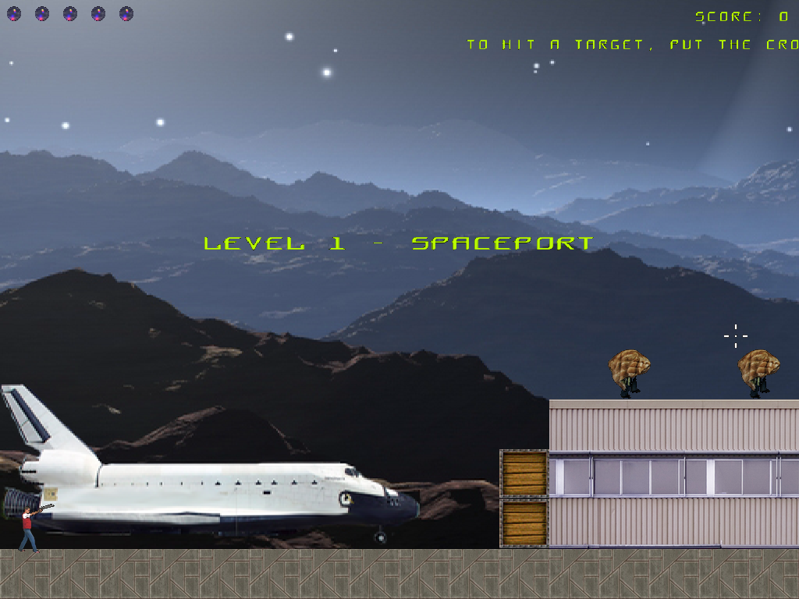
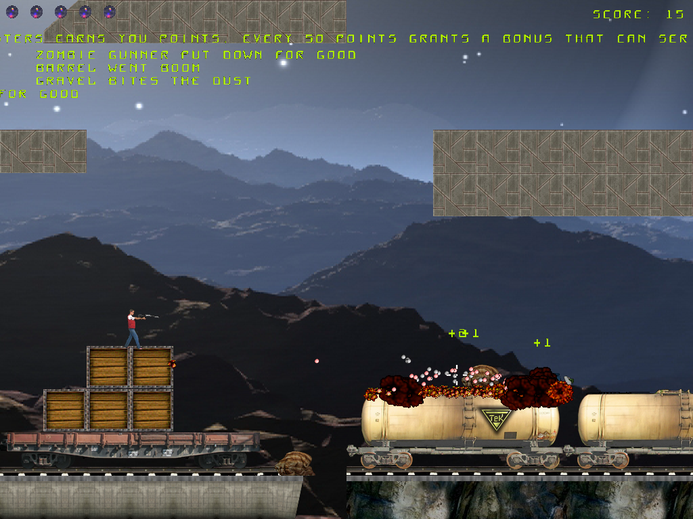

# Moon 2D

**A 2D platformer written in Delphi in 2008. Rebuilt from an empty folder in 2026.
Every line of code is new. Nothing about the game changed.**

[](https://www.youtube.com/watch?v=xum3U9OkVf4)

<sub>↑ 90 seconds of trailer. Every frame is the running build.</sub>




---

## The short version

In 2008 a teenager wrote a platformer in Delphi 2005. One file. Immediate-mode
OpenGL. Level geometry in a hand-rolled binary format. A 20 ms `WM_Timer` doing
duty as a game loop.

It ran. Most of it ran for reasons that were never written down anywhere.

Eighteen years later the whole thing was deleted and built again from nothing.
New renderer, new file formats, new asset pipeline, new soundtrack, new
language — Delphi 2005 and current Delphi are separated by the Unicode break,
generics, inline variables, and the retirement of immediate-mode OpenGL.

And the game that came out the other side is the same game. Same jump arc, same
frame counts, same monsters doing the same wrong-looking thing on screen
fourteen. Same *arithmetic*: where the 2008 source held a formula, that formula
was carried over verbatim, with a comment naming the file and line it came from.
Not simplified. Not tidied. Cited, like a source in a paper.

**Replace the entire machine. Change nothing the player can feel.** That was the
rule, and it is the only interesting thing about this project.

| Torn out and rebuilt | Carried across untouched |
| --- | --- |
| OpenGL → SDL2, D3D11 backend | Every sprite, drawn by hand in 2008 |
| `WM_Timer` → fixed 33 Hz timestep | Hero physics, constant for constant |
| Binary level blobs → readable JSON | Collision oracles, including the asymmetric ones |
| Loose PNGs → `.mset` sprite containers | Weapon patterns, all five of them |
| Hardcoded monsters → `monsters.json` | The bullet-spawner particle hacks |
| Third-party music → an original score | The bitmap font, glyph for glyph |
| One long file → a unit per responsibility | The feel. Which is the whole point. |

Eight deliberate departures from the original exist. They are enumerated in
[`PORTING.md`](PORTING.md). Anything else that differs is a bug, not an
improvement — a closed list is the only thing that stops a rewrite from drifting
into a remake.

---

## The game

A soldier lands on a lunar mining complex that stopped answering three days ago.
The transmitter is on the far side of it. Between him and the transmitter is
everything that came up out of the shafts.

You walk right. You shoot. Monsters keep coming — the game's own design document
would have said *"как из рога изобилия"* if it had had one. Somewhere in the
middle of it a transformation sequence lifted wholesale from Japanese tokusatsu
television happens to you, and the screen fills with five converging waves of
bullets, and it is completely unearned and absolutely correct.

Two levels ship today — the entire 2008 campaign, start to finish, in English
and Russian. Eight more are coming. The tenth does not end on the Moon.

**Controls**

| | |
| --- | --- |
| Move | Arrow keys |
| Jump | Up |
| Aim | Mouse |
| Fire | Left mouse button |
| Pause / menu | Esc |

---

## Greatest hits from the excavation

The port turned up things the original author — me — had no memory of writing.
Full accounts in [`PORTING.md`](PORTING.md); the highlights:

- **The timer lied for eighteen years.** The loop asked Windows for 20 ms.
  `WM_Timer` delivered about 33. Every constant in the game — jump height,
  monster speed, fire rate — was tuned by hand against a number that appears
  nowhere in the source. The specification lived in an OS scheduler.

- **The font atlas has been stored sideways since 2008, and it was correct.**
  The old texture loader transposed on upload. The glyphs were *authored*
  through that same broken path — drawn, rotated until they looked right,
  saved. A bug compensated elsewhere is not a bug. It is a load-bearing wall.

- **Two ground probes, `y-3` and `y+3`, that must never be unified.** One for
  the hero, one for monsters, written years apart, each correct inside its own
  caller. Merge them and monsters sink into floors. They look like the same
  function. They are not the same function. Both were ported, both kept, both
  commented with a warning.

- **The animation counter runs backwards.** `9 - Round(CurrentSprite)`.
  Preserved. And `Round` in Delphi is banker's rounding, which quietly picks a
  different frame than a naive reading expects — documented, not fixed.

- **Every fourth frame was going somewhere.** SDL2 still defaults to the
  Direct3D **9** renderer on Windows. The hint that fixes it is ignored
  silently if you set it after creating the renderer.

---

## Read the code

That is half the reason this repository is public. It is modern Object Pascal
written the way modern Object Pascal should look — guard clauses, records for
data that travels together, `implementation uses` by default, no `with`, no
aligned columns, no `u` prefixes. Every unit declares one responsibility.

Good places to start:

- **`Hero.pas`** — physics, weapons, death. The densest concentration of
  cited-2008 arithmetic in the project, and the clearest picture of what
  "preserve the formula" means in practice.
- **`Bullets.pas`** — the particle system, which in 2008 was five different
  abuses of the projectile list. A 180-fragment explosion fan; 768 slow bullets
  raining on a grid; a motionless cloud of them used as a shield. All still
  hacks. All now named.
- **`Moon2D.dpr`** — composition root and game-flow state machine. Not a stub.
- **`docs/CODEBASE-MAP.md`** — the whole layout, unit by unit, if you would
  rather orient before diving.

---

## Playing

Take the release archive, unpack it, run `Moon2D.exe`. Nothing installs, nothing
registers, nothing phones anywhere. Starts fullscreen; if the screen stays
black, set `"fullscreen"` to `false` in `config.json`.

Cloning and building works too, and the clone is complete — the soundtrack is
in the repository now that the tracks are finished and mine. If you delete
`bin/music/` anyway, the game does not care: the audio DLL is a delayed import,
so a missing library or a missing track degrades to silence rather than to a
crash.

## Building

Developed on the current RAD Studio release, Win32 target. No third-party
components.

1. Open `Moon2D.dproj`
2. Build and run — output lands in `bin\`, next to the assets

The real floor is inline variable declarations, which arrived in **Delphi 10.3
Rio** — anything from there upward builds this. Nothing newer is used
deliberately, and that includes the free Community Edition. The `.dproj` is
saved by a recent IDE and may want its version attribute nudged before an older
one will open it.

`SDL2.dll`, `SDL2_image.dll` and `SDL2_mixer.dll` live in `bin\` and are in the
repository already.

## Layout

```
*.pas, *.dpr           engine sources
bin/                   everything the game reads at runtime, and nothing else
  Moon2D.exe
  SDL2*.dll              renderer, image and mixer
  level1.json            geometry, backgrounds, entities, triggers, per screen
  level2.json
  monsters.json          movement, attacks, spawn tables, pickup effects
  config.json            window, tick rate, difficulty, language
  lang/                  en.json, ru.json
  sprites/               *.mset containers: manifest + packed frames, one file
                         per subject - a monster, a tile theme, the hero,
                         one level's screen backdrops
  sounds/                WAV one-shots
  music/                 OGG tracks
tools/                 SpritePackCli (asset packer), TitleCard (trailer text)
docs/                  working notes, codebase map, screenshots
```

`bin/` is the entire shipping surface. The release packager copies that folder
rather than consulting a list, because a directory layout that encodes the rule
cannot drift out of sync with it.

---

## Where this goes

Version 2 finished the original game. Phase two adds eight levels under one
rule: **every level must require new engine code.** A level that rearranges
existing tiles is content. A level that exists because a mechanic was written
for it is progress.

Queued:

- An ore transport train running the tunnels below the complex
- A level editor — sharing the game's own level and render units, previewing
  through SDL in a VCL host
- Render interpolation for the game world (the menu already has it)
- Levels 3 through 10, and the place the tenth one ends

## Documentation

- **[`PORTING.md`](PORTING.md)** — what breaks when you move 2008 Delphi and
  OpenGL to modern Delphi and SDL2. Coordinate systems, asymmetric probes,
  a rotated font atlas, and a rendering backend quietly costing you frames.
- **[`ASSETS.md`](ASSETS.md)** — where the art and audio came from, honestly.
- **[`docs/CODEBASE-MAP.md`](docs/CODEBASE-MAP.md)** — unit-by-unit structural map.
- **`docs/PORTING-NOTES.md`** — the unedited working log kept during the port.
  Russian, session by session, written for nobody.

## Related

- **[dark-planet-win](https://github.com/rm3g25/dark-planet-win)** — a 1998 DOS
  game reverse-engineered and ported to Delphi VCL. Same universe, earlier
  archaeology, worse tooling.

## License

Source code: [MIT](LICENSE). Art and audio are **not** covered by it — see
[`ASSETS.md`](ASSETS.md).

---

Ilia Kuzmin · [github.com/rm3g25](https://github.com/rm3g25) ·
[YouTube: Still Running](https://www.youtube.com/@stillrunning-dev)
